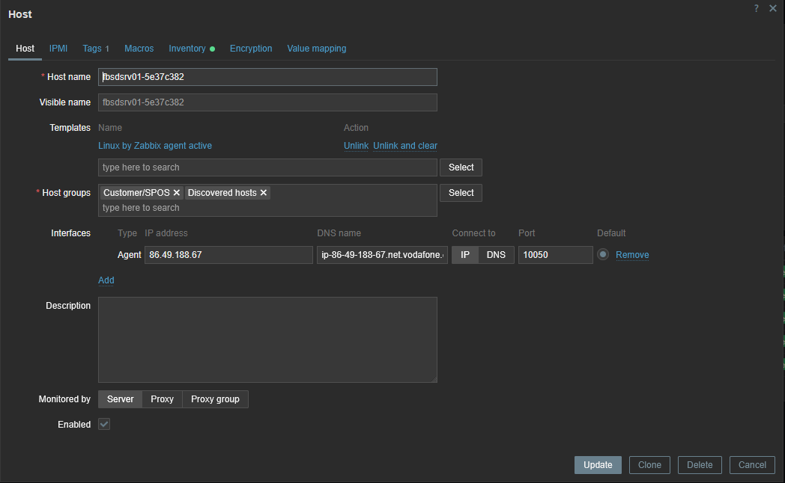

[](https://classroom.github.com/a/HlDpWB5G)
# zbx7-auto-reg

# Postup uprav

```console
mkdir fbsdsrv01 && cd fbsdsrv01
vi Vagrantfile
vi install-zabbix-agent.sh
vi configure-zabbix-agent.sh

vagrant up
```




# Nápověda

- [FreeBSD Projekt](https://www.freebsd.org)
- [Vagrant box bento/freebsd-14](https://portal.cloud.hashicorp.com/vagrant/discover/bento/freebsd-14)
- Zabbix 7.0 LTS [auto-registration](https://www.zabbix.com/documentation/7.0/en/manual/discovery/auto_registration)
- [Vagrant examples](https://github.com/sposdknl/2025-sposdk-osy/tree/main/Vagrant)

...
